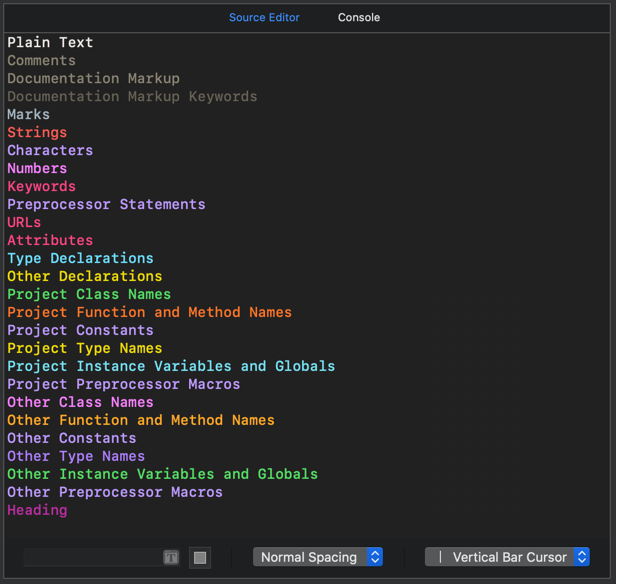

# Xcode Theme Monokai Colourful
This theme was inspired by [Xcode Monokai Revisited](https://github.com/halcyonmobile/xcode-monokai-revisited) and adapted to be more colourful.


Theme colours in the **Source Editor**.



## Installation

### Installation using the provided shell script

#### 1. Clone the repository 

##### Option A) Clone the repository via ssh

```bash
git clone git@github.com:denisenepraunig/xcode-theme-monokai-colourful.git
```

##### Option B) Clone the repository via https
```bash
git clone https://github.com/denisenepraunig/xcode-theme-monokai-colourful.git
```

#### 2. Install the theme
Run the install script inside the cloned repository.

```bash
./install.sh
```

### Manual installation

1. Copy **Monokai Colourful.xccolortheme** to the Xcode's ```FontAndColorThemes``` folder ```(~/Library/Developer/Xcode/UserData/FontAndColorThemes/)```. 
⚠️ *Note that the directory might not exist.* ⚠️
2. Restart Xcode.
3. Go to `Xcode` > `Preferences` > `Fonts & Colors`.
4. Select **Monokai Colourful**.
