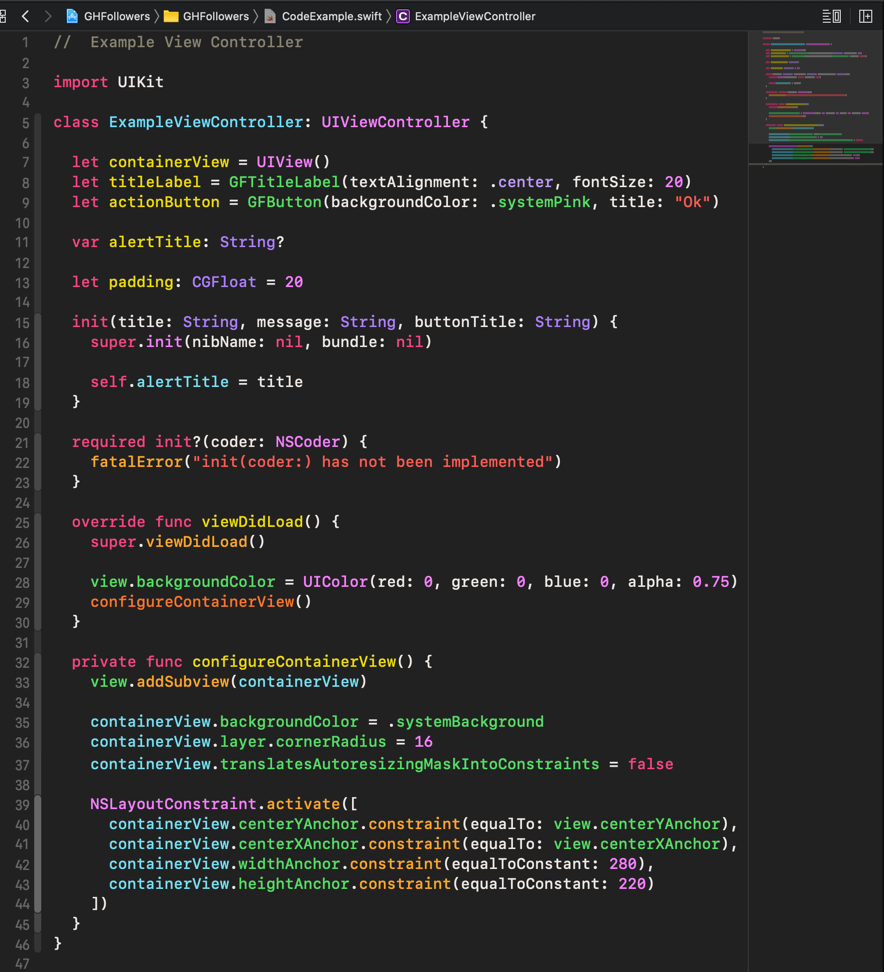

# Xcode Theme Monokai Colourful
This theme was inspired by [Xcode Monokai Revisited](https://github.com/halcyonmobile/xcode-monokai-revisited) and adapted to be more colourful.



Theme colours in the **Source Editor**.


## Installation

### Using the provided shell script

1. Clone the repository

```bash
git clone git@github.com:denisenepraunig/xcode-theme-monokai-colourful.git
```

2. Run the install script inside the cloned repository.

```bash
sh install.sh
```

### Manual

1. Copy **Monokai Colourful.xccolortheme** to the Xcode's ``FontAndColorThemes`` folder ``(~/Library/Developer/Xcode/UserData/FontAndColorThemes/)``. *Note that the directory might not exist.*
2. Restart Xcode.
3. Go to `Xcode` > `Preferences` > `Fonts & Colors`.
4. Select **Monokai Colourful**.
